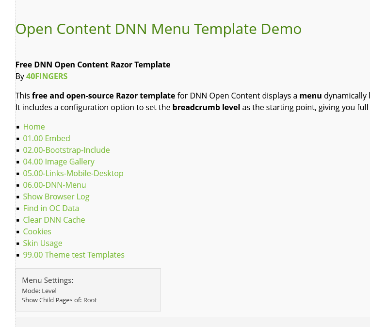
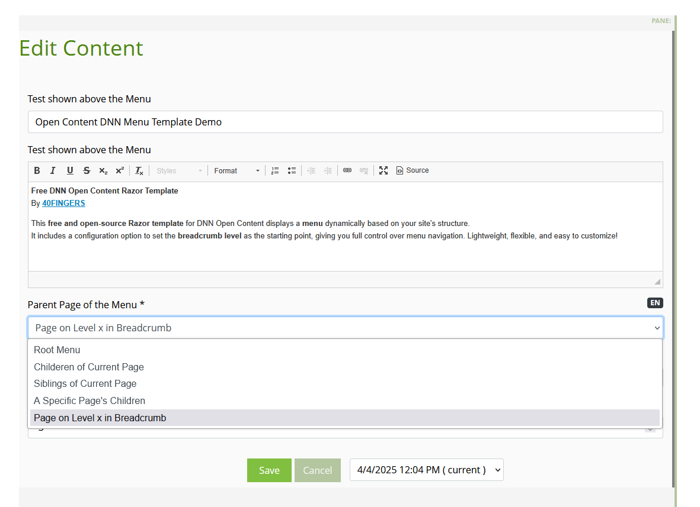

# Razor DNN Menu Template

**Free DNN [Open Content](https://opencontent.readme.io/) Razor Template**  
By [**40FINGERS**](https://www.40fingers.net)

This **free and open-source** **Razor template** for DNN [Open Content](https://opencontent.readme.io/) displays a **menu** dynamically based on your site's structure.  
It includes a configuration option to set the **breadcrumb level** as the starting point, giving you full control over menu navigation.  
For now the Menu is not styled, we might add Styled examples at a later stage.

In **edit mode**, the menu displays its configuration in an info block to help administrators debug and adjust settings.

Lightweight, flexible, and easy to customize!

Example:

