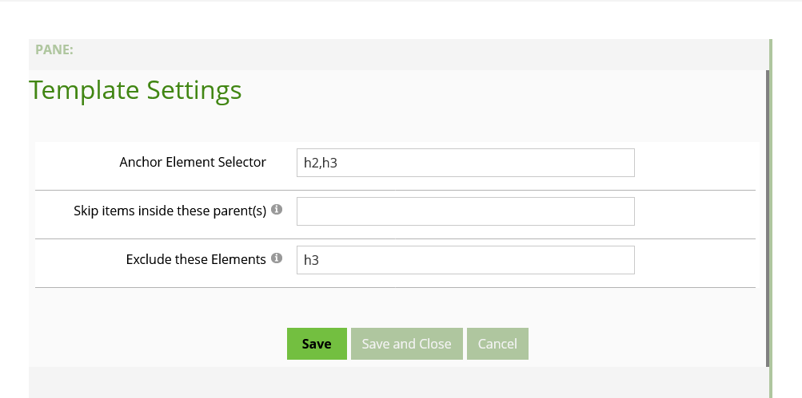

# Open-Content-Image-Gallery
Create in page deeplink anchor menu [Open Content](https://opencontent.readme.io/)

## Offset with Fixed header.

The reason we use a separate anchr is that ou can offset it if you use a fixed header.

Example:

`
.oc-toc-anchor{

    position:absolute;
    margin-top: -12em;
}

`