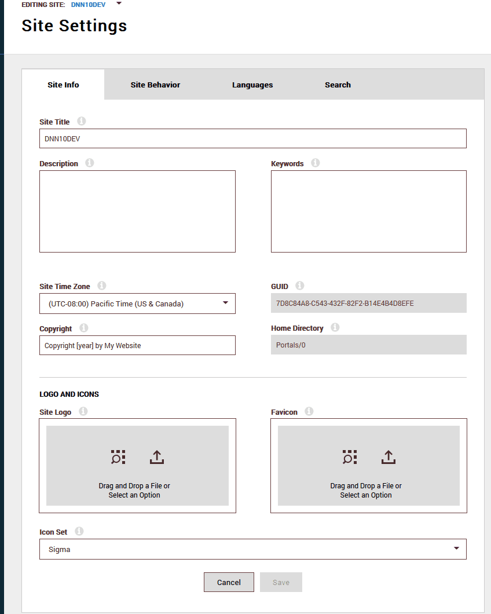

# DNN Persona Bar CSS Overrides via JS

**Author:** Timo Breumelhof, 40fingers  
**Status:** Experimental  

## Description
This file defines local CSS variables (`--pb-*`) and overrides some DNN framework variables (`--dnn-*`) to customize the Persona Bar appearance.

## Why we use JavaScript for these overrides
- The Persona Bar is dynamically generated by DNN and React.  
- Many CSS files and styles are injected asynchronously after the DOM is loaded, which means a static CSS file may be applied too early.  
- Certain DNN variables (`--dnn-*`) are hardcoded or dynamically added, making it difficult to override them purely with CSS.  
- Using JS allows us to wait until the iframe and its dynamic styles are fully loaded, then inject our override CSS at the bottom of `<head>`, ensuring our styles take precedence.

## Approach
1. Define a local palette (`--pb-*`) and optionally map it to `--dnn-*` variables.  
2. Use JavaScript to detect when the Persona Bar iframe exists.  
3. Wait until React/DNN dynamically injects CSS.  
4. Append our override CSS at the end of the iframe `<head>`.

Example:

